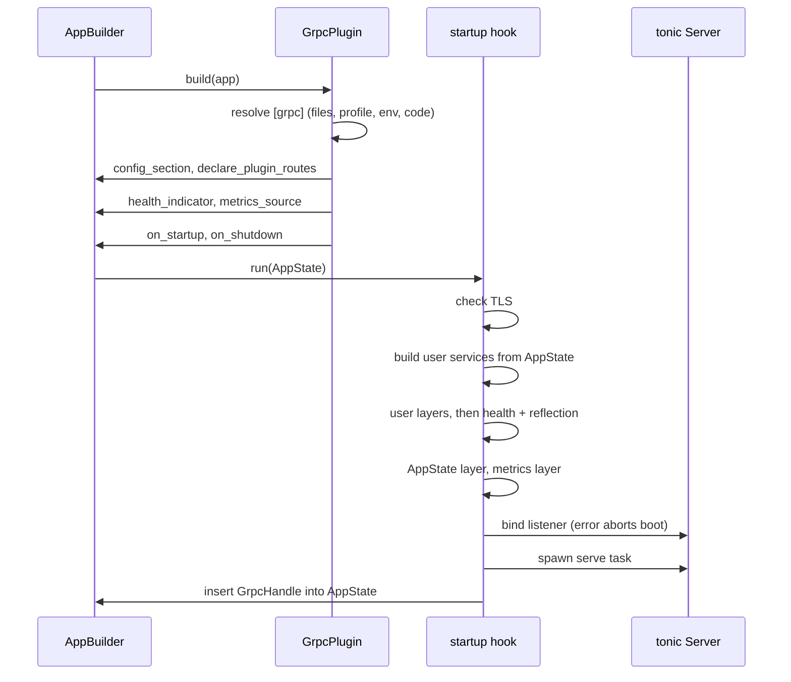
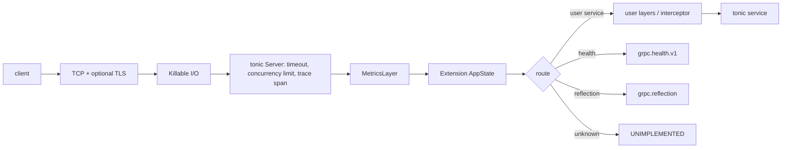
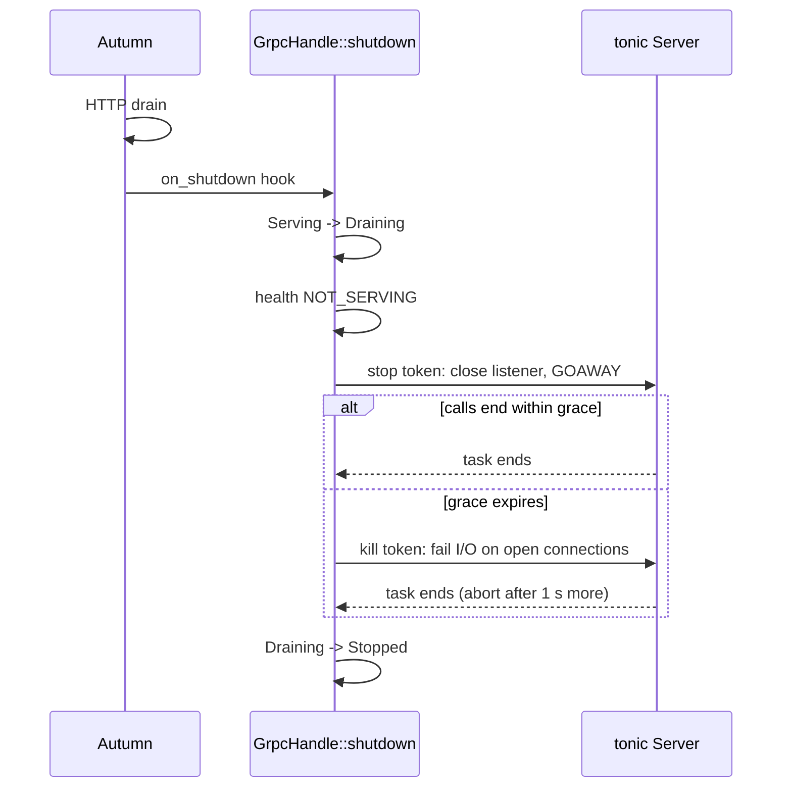

# Architecture

## Components

| File | Job |
|---|---|
| `src/plugin.rs` | `GrpcPlugin` builder. `Plugin::build` registers hooks, the health indicator, the metrics source and the route listing. Route assembly. |
| `src/config.rs` | `[grpc]` section: types, defaults, validation, layered resolution. |
| `src/server.rs` | Bind, serve, drain, close. `GrpcHandle`. |
| `src/lifecycle.rs` | Lifecycle state machine. The only way state changes. |
| `src/metrics.rs` | Metrics layer and bounded series store. |
| `src/health.rs` | Autumn `HealthIndicator` and `MetricsSource`. |
| `src/tls.rs` | TLS config from files (feature `tls`). |
| `src/error.rs` | `GrpcError`: startup failures. |

## Boot

## Request path

User layers wrap only user services. axum applies `layer` to the routes
that exist when it is called. The plugin adds health and reflection after
the user layers.

## Shutdown

tonic spawns a task per connection. Aborting the server task does not
stop them. The `Killable` I/O wrapper closes them when the kill token
fires.

## Lifecycle

See `src/lifecycle.rs`. States: `Idle`, `Serving`, `Draining`,
`Stopped`, `Failed`. `LifecycleCell` applies events with a
compare-and-swap loop. `tests/lifecycle.rs` checks all 25
state × event pairs against the spec table and property-tests the
invariants.
