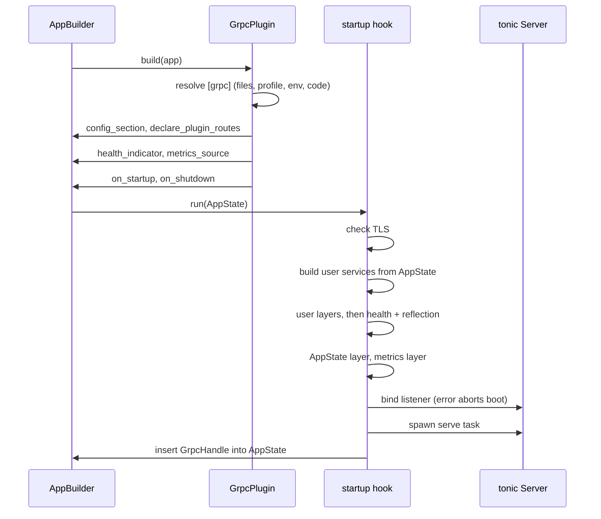
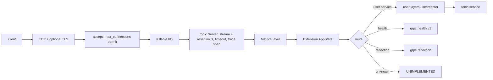
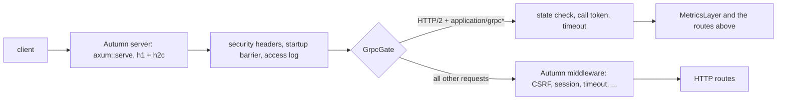
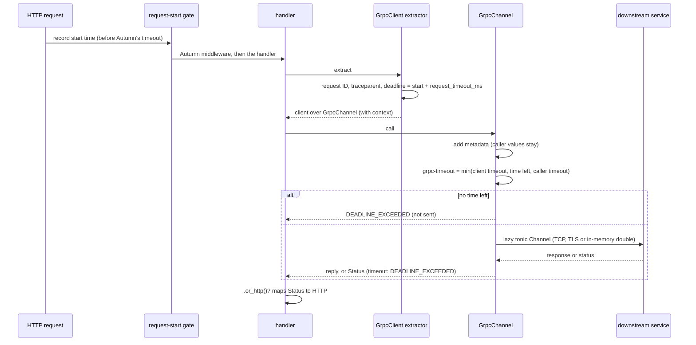
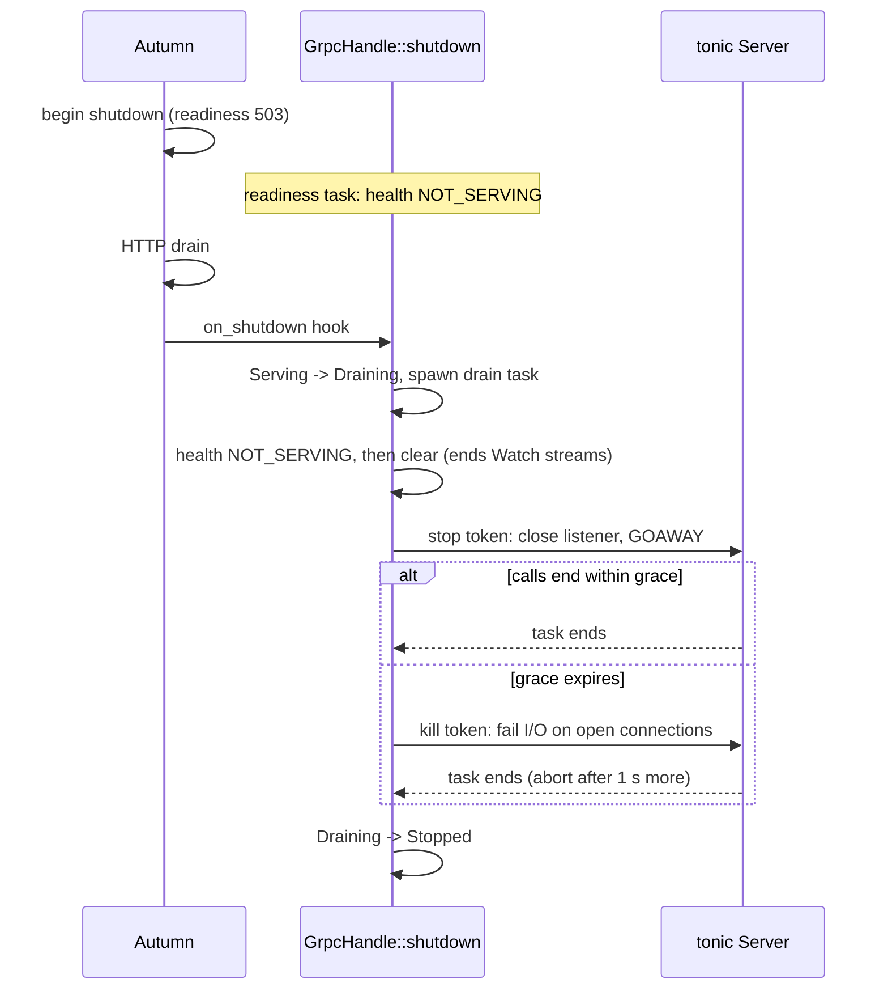

# Architecture

## Components

| File | Job |
|---|---|
| `src/plugin.rs` | `GrpcPlugin` builder. `Plugin::build` registers hooks, the health indicator, the metrics source and the route listing. Route assembly. |
| `src/config.rs` | `[grpc]` section: types, defaults, validation, layered resolution. |
| `src/server.rs` | Bind, serve, drain, close. `GrpcHandle`. |
| `src/gate.rs` | Shared listener: the `static_gate` layer on Autumn's router (ADR 0008). |
| `src/lifecycle.rs` | Lifecycle state machine. The only way state changes. |
| `src/metrics.rs` | Metrics layer and bounded series store. |
| `src/health.rs` | Autumn `HealthIndicator`. |
| `src/registry.rs` | `GrpcServers`: all servers of an app, and the one Autumn `MetricsSource`. |
| `src/tls.rs` | TLS config from files (feature `tls`). |
| `src/error.rs` | `GrpcError`: startup failures. |
| `src/timeout.rs` | `grpc-timeout`: parse and encode. |
| `src/client/mod.rs` | Feature `client`: `GrpcClients` registry and extractor, `GrpcClient<T>`, `GrpcPlugin::client*`, boot checks (ADR 0009). |
| `src/client/channel.rs` | `GrpcChannel`: propagation, deadline and metrics around a tonic `Channel`. |
| `src/client/context.rs` | Request context (request ID, trace headers, deadline) and the request-start gate. |
| `src/client/status.rs` | `tonic::Status` → `AutumnError` code map, `.or_http()`. |
| `src/client/metrics.rs` | `grpc_client_*` metrics. |
| `src/client/memory.rs` | In-memory test doubles over `tokio::io::duplex`. |

## Boot

## Request path

### Shared listener

The gate answers `UNAVAILABLE` when the state is not `Serving`. The
response body keeps the call token until it ends. The drain waits for the
tokens, then ends the open bodies.

User layers wrap only user services. axum applies a layer only to the
routes that exist when the code calls `layer`. The plugin adds health and
reflection after the user layers.

## Client call

Each call goes into `grpc_client_*` metrics when its response body ends.

## Shutdown

tonic spawns a task for each connection. An abort of the server task
does not stop them. The `Killable` I/O wrapper closes them when the kill
token fires. Each connection has a child token, so each poll locks only
its own token.

The drain runs in its own task. If Autumn drops the hook future, the
drain continues (ADR 0007).

## Lifecycle

See `src/lifecycle.rs`. States: `Idle`, `Serving`, `Draining`,
`Stopped`, `Failed`. `LifecycleCell` applies events with a
compare-and-swap loop. `tests/lifecycle.rs` checks all 25
state × event pairs against the spec table. Property tests check the
invariants.
